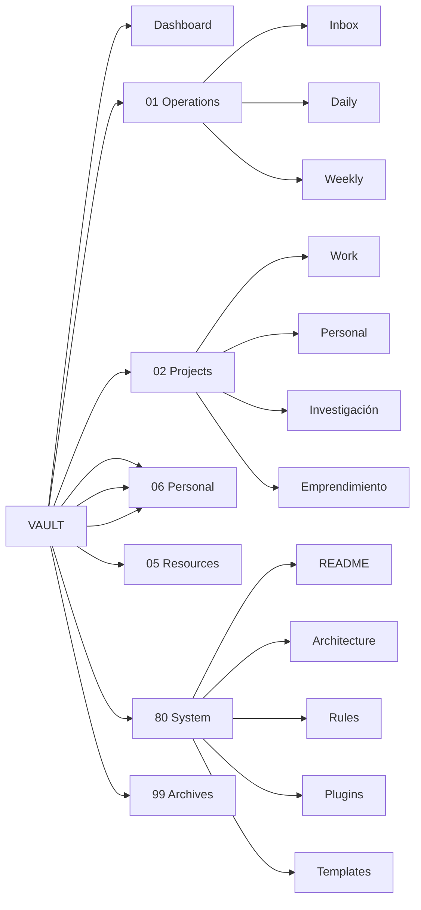

Vault/
├── Dashboard.md

├── 01 Operations/
│   ├── Inbox/
│   └── Daily/
├── 02 Projects/
├── 03 Areas/
├── 04 Resources/
└── 05 Archives/
├── 80 System/

```mermaid
flowchart LR
    V["VAULT"]

    V --> D["Dashboard"]
    V --> O["01 Operations"]
    V --> P["02 Projects"]
    V --> A["03 Ideas"]
    V --> A["04 Knowledge"]
    V --> R["05 Resources"]
    V --> A["06 Personal"]
    V --> S["80 System"]
    V --> X["99 Archives"]

    S --> SR["README"]
    S --> SA["Architecture"]
    S --> SL["Rules"]
    S --> SP["Plugins"]
    S --> ST["Templates"]

    O --> OI["Inbox"]
    O --> OD["Daily"]
    O --> OW["Weekly"]
    
    P --> PW["Work"]
    P --> PP["Personal"]
    P --> PI["Investigación"]
    P --> PE["Emprendimiento"]
```
